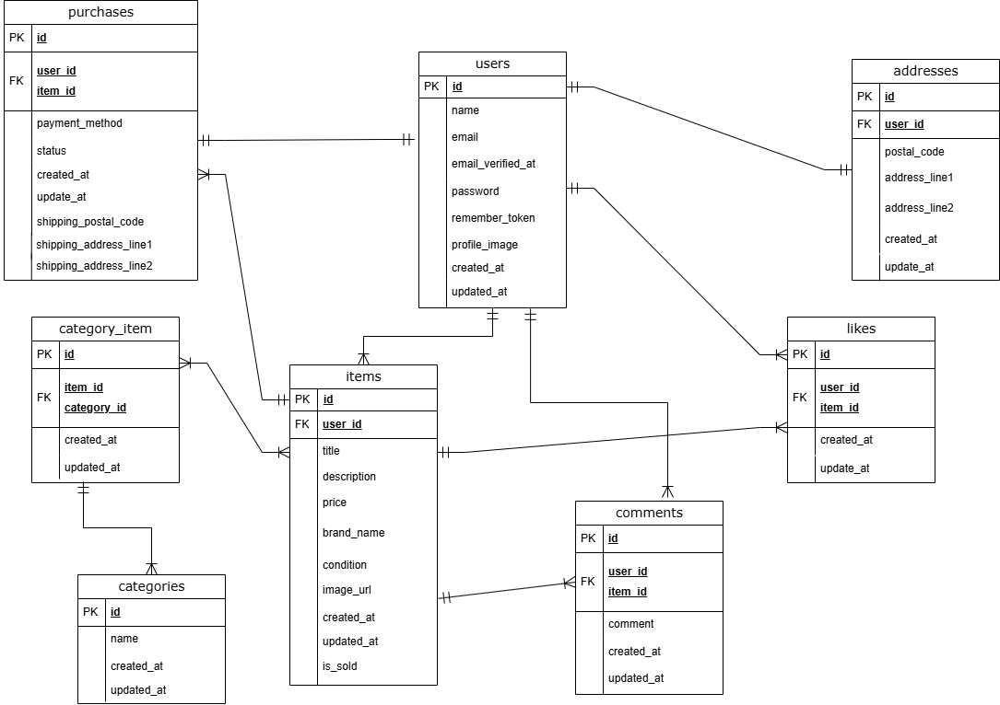

# coachtech フリマアプリ

## 概要

このアプリは Laravel を使用したシンプルなフリマアプリです。
ユーザー登録、商品出品、購入、コメント、お気に入り登録などの基本機能に対応しています。
Docker による環境構築や、メール認証付きログインも実装済みです。

---

## 機能要件について

本アプリは、課題で提示されたすべての機能要件【US001 〜 US009】を満たすように実装されています。

- Fortify を用いた会員登録・ログイン・ログアウト機能 (メール認証付き)
- ユーザープロフィールの確認・編集機能 (画像アップロード含む)
- 商品の出品・編集・削除・画像アップロード
- 商品一覧・詳細・検索・いいね・コメント機能
- 購入処理 (配送先選択・支払い方法選択・購入完了処理)
- マイページ (出品商品・購入商品一覧) 表示機能
- バリデーションおよびエラーメッセージ対応

---

## Stripe 接続について

- 「カード支払い」「コンビニ支払い」の選択後、**Stripe の checkout 経由で決済画面へ接続**される仕様を実装しています
- 本アプリは決済画面までの動線を保証しており、**実際の課金は行われません** (デモ用)
- セキュリティ上の理由から、**バックエンド側での Stripe 実践購入処理は未実装**です

---

## 環境構築手順

### Docker コンテナ構築

```bash
docker compose up -d --build
```

### Laravel 初期セットアップ

```bash
cp src/.env.example src/.env
docker compose exec php bash

# 以下は php コンテナ内で実行
composer install
php artisan key:generate
php artisan migrate
php artisan db:seed
```

---

## 開発環境 URL

- トップページ: http://localhost/
- ユーザー登録画面: http://localhost/register
- phpMyAdmin: http://localhost:8080/

---

## 使用技術 (実行環境)

- PHP 7.4.9
- Laravel 8.83.29
- MySQL 8.0.26
- nginx 1.21.1
- Stripe PHP SDK

---

## 補足技術情報

- **メール送信確認:** MailHog にて確認済
- **ログイン時:** メール認証必須
- **Faker:** PrefectureProvider により自然な日本語地名ダミー生成実装

---

## ER 図



---

## 設計・仕様メモ

- `/mypage` はプロフィール画面を指し `profile.blade.php` を使用
- `mypage.blade.php` は削除済
- `UserController@show`内で `tab=buy` / `tab=sell` の分岐で商品表示を切り替え
- 設計書に準拠した構成で、提出に適した状態です

---

## テストに関する注意事項

- 会員登録テスト「register with all valid inputs redirects to login」を通すため
  `RegisterController`に `VerifyEmail` 通知処理を一時的に追加しています

- 本番は Fortify で十分なため、該当コードはコメントアウト/削除してください

- 「SOLD ラベル表示」テストは、ログインユーザーが出品者にならないよう、別ユーザーの商品を利用しています

### 決済処理 (= Stripe) のテストについて

- 「購入する」ボタン押下時に checkout 画面への **302 リダイレクト** を行うことを確認しています
- リダイレクト先 URL は Stripe の checkout ドメイン (`https://checkout.stripe.com/...`)
- Stripe 決済完了後の `payment_success.blade.php` は、少し後で `PaymentSuccessTest` として `assertViewIs('payment_success')` で確認予定

---

## メール認証後のリダイレクト先

```php
// routes/web.php
return redirect('/login'); // テスト用
// return redirect('/mypage'); // 本番用
```

- テスト便利性を優先し `/login`へリダイレクトしています
- 実運用では UX を考慮し `/mypage` へのリダイレクトを推奨
